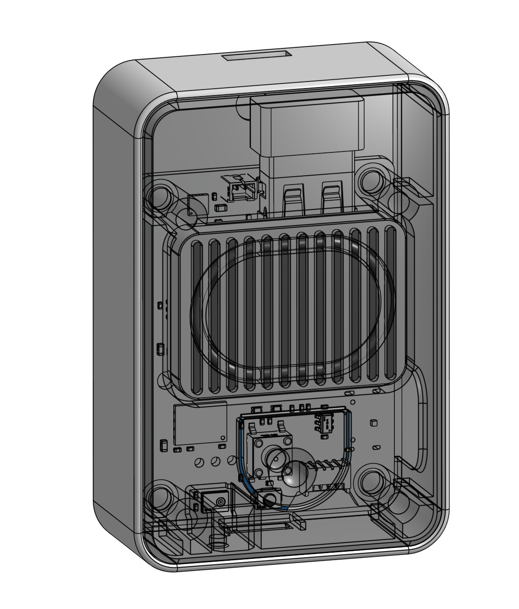

# Sonnette - Smart SIP Doorbell powered by RK3506

A smart doorbell that runs Linux and acts as its own phone server. When
someone presses the button, it calls your phone: a regular phone call,
not a push notification from some app.

The doorbell is a SIP client (like a VoIP phone) built around
[pjsua/pjsip](https://www.pjsip.org/), a battle-tested open-source SIP
stack. It registers on a Twilio SIP domain, and when triggered, it asks
Twilio to call your number and bridge the audio. You pick up the phone,
and talk to the person at the door directly, with no cloud/IoT service
in-between.

Twilio is just the SIP-to-PSTN bridge. The audio goes through Twilio's
infrastructure during the call, but nothing is stored or recorded. You
can replace Twilio with any SIP provider (OVH Telecom, VoIP.ms, etc.)
if you prefer.

- Running cost: ~1.20 €/month for the phone number (French 09xx) plus
~0.04 €/min per call to a local mobile. See
[docs/twilio.md](docs/twilio.md#cost-estimate) for details.

- Build costs: ~50 € PCBA (JLCPCB, single qty) plus a dozen euros for 
the speaker, 3D-printed enclosure & WiFi dongle.

## Architecture

Two processes on the board: **sonnette** (Go) orchestrates everything,
**pjsua** (C/pjsip) handles SIP and audio.

```
Button → sonnette → Twilio API →  phone rings
            │                          ↓
            │                     you pick up
            │                          ↓
            └→ aplay chime       Twilio bridges
               on speaker         SIP ←→ PSTN
                                       ↓
                         Continuous bidirectional stream:
                      PDM mic → pjsua → RTP → Twilio → phone
                      speaker ← pjsua ← RTP ← Twilio ← phone
```

### sonnette (Go daemon)

The main process. Source in `sonnette/`.

- **GPIO watcher**: monitors the ring button via sysfs `poll()` with
  software debounce (300 ms). Active low, falling edge.
- **Dingdong playback**: plays `dingdong.wav` on the speaker via
  `aplay` (synchronous, blocks until done to avoid ALSA device
  contention with pjsua).
- **Twilio REST API**: POSTs to Twilio to initiate the outbound call
  to your phone. 10 s HTTP timeout to avoid blocking on flaky internet.
- **Cooldown**: prevents button spam (configurable: default 30 s
  cooldown, max 10 calls/hour).
- **pjsua supervisor**: starts pjsua as a child process, restarts it
  on crash (3 s backoff). SIP credentials are written to a temp file
  (`/run/pjsua-account.cfg`, chmod 0600) so they don't appear in `ps`.
  pjsua's stdout/stderr is captured to `/var/log/pjsua.log` via
  `stdbuf -oL` for line-buffered output.
- **Health endpoint**: serves `GET /health` on a configurable port
  (default 8080) returning JSON with uptime, pjsua status, WiFi state,
  and last ring activity. Used by a home server to detect when the
  doorbell is down.
- **Event webhook**: optional. POSTs JSON events (`button_press`,
  `call_initiated`, `call_failed`, periodic `heartbeat`) to a
  configurable URL for push-style notifications.
- **Config**: reads `sonnette.yaml` (settings) and `sonnette.conf`
  (credentials, shell KEY="value" format, parsed directly in Go).

### pjsua (SIP client)

Cross-compiled C binary from pjproject. Source/Makefile in `pjsua/`.

Handles SIP registration on Twilio, auto-answers incoming INVITEs, and
bridges two-way audio between the PDM mic + I2S speaker and the RTP
stream. Runs at 16 kHz hardware sample rate, resampled internally to
8 kHz PCMU for SIP.

### Twilio

SIP-to-PSTN bridge. Connects the VoIP call to your phone number.
See [docs/twilio.md](docs/twilio.md) for the full setup guide.

## Quick start

1. **Set up Twilio** — account, phone number, SIP domain, TwiML Bin.
   You need the credentials in hand before deploying. See
   [docs/twilio.md](docs/twilio.md).
2. **Build the Linux image** — copy the BSP files into the Rockchip
   SDK, build the SDK image, then flash it. This may happen directly on
   your host or inside the SDK's Docker container depending on your setup;
   see [docs/hardware.md](docs/hardware.md#2-linux-image--bsp).
3. **Deploy the software** — build sonnette + pjsua, sanity-check the
   fresh image audio path, prepare secrets, deploy over ADB, install init
   supervision, harden SSH, then verify the runtime. See
   [docs/deploy.md](docs/deploy.md).
4. **Press the button** — phone rings.

The repo uses a small, readable `Makefile` to keep repetitive steps
simple without hiding the system. The `.md` guides explain the workflow
and trade-offs; `make help` lists the available shortcuts; and the
Makefile itself is the place to inspect the exact commands.

## Hardware

Developed on a custom Rockchip RK3506G2 board. The `bsp/` directory has the
device tree and SDK configs; the `eda/` directory contains the EasyEDA Pro
design files. The software itself is plain Linux + Go + pjsua, it runs 
on any SBC with ALSA audio and a GPIO (Raspberry Pi, BeagleBone, etc.). 



The pictured enclosure is a 3D-printed prototype (its CAD sources are not
published here yet).

To port it, expect to adjust:

- **Init system**: the deploy scripts assume BusyBox `inittab`. On a
  systemd distro, use a `sonnette.service` unit instead. Logs work the
  same with `journalctl -u sonnette`.
- **ALSA card numbers**: `deploy/asound.conf` references the RK3506
  PDM (`hw:0,0`) and SAI1 (`hw:1,0`) cards. Other boards expose audio
  on different cards; adjust the device names and the mono→stereo
  routing if your codec doesn't need it.
- **PDM gain**: `amixer -c 0 cset numid=7 100%` is RK3506-specific.
  Other mics/codecs expose different mixer controls (or none).
- **Network interface**: defaults to `wlan0`; rename in `S90wifi` if
  your board uses something else.

See [docs/hardware.md](docs/hardware.md) for the pin map, BSP build
and hardware reference, and [docs/deploy.md](docs/deploy.md) for the
ALSA, pjsua and WiFi runbooks. Cross-compile of pjsua against the
target sysroot is documented in [pjsua/README.md](pjsua/README.md).

## Security and privacy model

This is a personal/home device, not an industrial high-security product.
The production setup does the practical basics: disable ADB, harden SSH
to key-only login, randomize the root password, optionally disable UART
login, keep credentials in `0600` files, optionally enable a restrictive
firewall, and expose health/webhook signals so failures or tampering can
be noticed quickly.

The design still assumes physical access is a strong attacker capability.
The software runs as root on a small Buildroot system, and if someone
removes the doorbell from the wall, they could theoretically extract 
WiFi and Twilio/SIP credentials from flash. If USB ADB and UART login are
disabled, normal maintenance goes through SSH; if SSH/WiFi is lost,
recovery is Maskrom reflash. The expected security response to a missing
or compromised unit is operational: revoke the SIP password/Auth Token
and rotate WiFi credentials if needed.

That trade-off is intentional. The project avoids an always-on video
doorbell and avoids a proprietary IoT cloud account. In places where
filming shared hallways or common areas is legally or socially
problematic, an audio-only phone-call doorbell is often a better fit.
Twilio remains a third-party SIP/PSTN bridge, but the doorbell's SIP leg
uses TLS signaling and SRTP media; there is no Amazon Ring/Tapo-style
cloud service that can activate a camera, collect video, or change device
behavior remotely without you controlling the software on the board.

## License

Software, firmware, scripts and documentation are released under the MIT
License unless stated otherwise. Hardware design files are released under
CERN-OHL-P-2.0. See [LICENSE](LICENSE) for the full license map.
