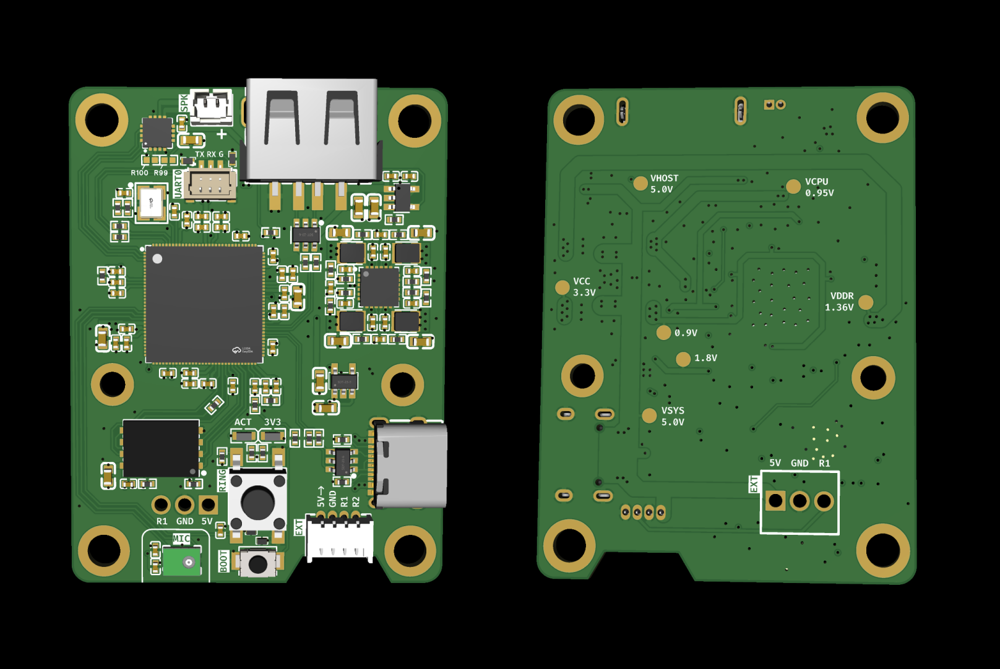
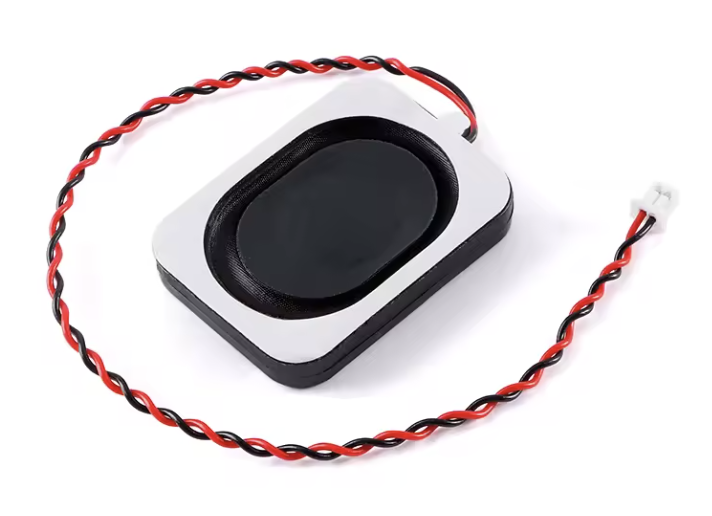

# Hardware

## Contents

1. [Overview](#1-overview)
2. [Linux Image / BSP](#2-linux-image--bsp)
3. [SDK Reference](#3-sdk-reference)
4. [Hardware Details](#4-hardware-details)

## 1. Overview

Sonnette runs on a custom board built around the Rockchip RK3506G2: 3x
Cortex-A7, 128 MB RAM in-package, native PDM + I2S audio peripherals,
SPI NAND storage, and full Linux with glibc.



For this project, the RK3506 is deliberately more capable than an MCU,
with an highly competitive cost (~7 EUR/pc for "G2" SIP variant) and
a very easy PCB integration: QFN package, no DDR to route - just needs
external Flash storage, HSE crystal, a few caps/resistors & 
5 buck/LDO regs (or PMIC).

The extra headroom buys a normal Linux runtime: Go, pjsip, ALSA,
wpa_supplicant, syslog, SSH, and familiar deployment/debugging tools.
Measured board power is roughly 0.5 W idle to 0.7 W active, including
the speaker & USB WiFi dongle used for connectivity.

The repo separates the hardware-related concerns:

- `docs/hardware.md` (this file) is the human-facing hardware, BSP,
  build and debug guide.
- `bsp/` contains the board support files copied into the Luckfox/Rockchip
  SDK: device tree and Buildroot/Rockchip defconfigs.
- `eda/` contains the schematic PDF (`sonnette_sch.pdf`), a 3D render
  of the assembled PCB (`sonnette_pcb_3d.png`), and the editable
  EasyEDA Pro project (`sonnette.epro`).

Main components:

| Component | Ref | Role |
|-----------|-----|------|
| SoC | Rockchip RK3506G2 | Linux application processor |
| PDM mic | ST MP34DT05TR-A | Door-side microphone |
| I2S amp | Maxim MAX98357A | Speaker driver |
| SPI NAND | XTX XT26G04C | Root filesystem storage |
| WiFi | TP-Link TL-WN725N / RTL8188EU | WiFi USB dongle |
| Button | Tactile switch on RMIO0 | Doorbell input, active low |

## 2. Linux Image / BSP

The build process piggybacks on the **Luckfox Lyra SDK**, which wraps
Rockchip's RK3506 SDK with U-Boot, Linux 6.1, Buildroot, and board
support for the Luckfox Lyra product line. Bring-up for this board was
done with `Luckfox_Lyra_SDK_250815.tar.gz`; the same DTS and kernel
config approach should work with other RK3506 SDKs shipping Rockchip's
Linux 6.1 BSP.

The SDK provides:

- U-Boot SPL + U-Boot (Rockchip fork)
- Linux kernel 6.1 (Rockchip BSP tree)
- Buildroot rootfs and toolchain (`arm-buildroot-linux-gnueabihf`)
- RMIO flexible pin muxing for GPIO0 pins
- Rockchip flashing tools, including `rkflash.sh`

This repo adds:

- Custom DTS/DTSI files for the Sonnette board
- A Rockchip SDK defconfig selecting the board DTS, kernel fragment and
  rootfs settings
- A Buildroot defconfig for the target rootfs packages and NAND geometry

The flow below builds and flashes the image first. SDK/BSP and hardware
details come afterwards as reference.

### Build The Image

First sync the repo's BSP files into the Luckfox/Rockchip SDK:

```bash
make sdk-sync SDK_ROOT=<SDK>
```
- copies the Sonnette DTS/DTSI files to
  `<SDK>/kernel-6.1/arch/arm/boot/dts/`
- copies `bsp/rk3506_sonnette_kernel.config` to
  `<SDK>/kernel-6.1/arch/arm/configs/`
- copies the Rockchip board defconfig to
  `<SDK>/device/rockchip/.chips/rk3506/`
- copies the Buildroot defconfig to `<SDK>/buildroot/configs/`

It only copies files; it does not start a build. The exact commands are
visible in the repo-root `Makefile`.

**Important:** before building, make the manual U-Boot XTX edit described
in [SPI NAND Flash](#spi-nand-flash). This is the only SDK change that is
not automated by `make sdk-sync`: the Rockchip U-Boot config lives outside
the board/Buildroot override files copied by this repo. The Linux kernel
and Buildroot settings are handled by the files copied by `make sdk-sync`.

Then select and build from the SDK environment appropriate for your
machine. If your Luckfox/Rockchip SDK setup requires Docker, run these
commands inside the SDK container:

```bash
cd <SDK>
./build.sh lunch    # Custom -> custom_sonnette_buildroot_spinand
./build.sh
```

Output:

```text
<SDK>/rockdev/update.img
```

For setups where the SDK can be built directly from the repo host,
`make image SDK_ROOT=<SDK>` wraps `make sdk-sync` plus the two SDK
commands above.

### Flash The Board

`rkflash.sh` is Rockchip's proprietary flash script, shipped at the root
of the Luckfox Lyra SDK. It is not in this repo.

1. Put the board in Maskrom mode: hold BOOT, power on, release.
2. Run `lsusb` and confirm a Rockchip USB device, typically `2207:350a`
   for RK3506 in maskrom.
3. Flash from the SDK root:

```bash
cd <SDK>
sudo ./rkflash.sh update     # flashes the SDK-built update.img
```

If `rkflash.sh` says the device is not detected, re-check maskrom mode and
make sure no other process holds the USB device.

At this point the board can boot the Sonnette Linux image. Continue with
the fresh-image sanity check and deployment steps in
[deploy.md](deploy.md#2-fresh-image-sanity-check). The rest of this
document is reference material if you want to understand the SDK/BSP
details or the hardware choices.

## 3. SDK Reference

This section documents the SDK files and configuration choices behind the
image build flow above.

### BSP Files

These files in `bsp/` are **copied as-is** into the SDK at build time
(see "Build The Image" above). They carry every defconfig override the
Sonnette board needs on the Buildroot/Rockchip/kernel side. The only
remaining manual SDK edit is XTX support in U-Boot, called out below.

| File | SDK destination |
|------|-----------------|
| `bsp/rk3506g-custom-sonnette.dts` | `kernel-6.1/arch/arm/boot/dts/` |
| `bsp/rk3506-custom-sonnette.dtsi` | `kernel-6.1/arch/arm/boot/dts/` |
| `bsp/rk3506_sonnette_kernel.config` | `kernel-6.1/arch/arm/configs/` |
| `bsp/custom_sonnette_buildroot_spinand_defconfig` | `device/rockchip/.chips/rk3506/` |
| `bsp/rockchip_rk3506_sonnette_defconfig` | `buildroot/configs/` |

The reference sections below describe what each customization does. A
**Status** line at the top of each block says whether you need to do
anything manually in the SDK or whether `bsp/` already handles it.

### SPI NAND Flash

The board uses an XTX XT26G04C SPI NAND (4 Gbit), which differs from the
Winbond W25N02KV found on stock Luckfox Lyra boards:

| Param | XT26G04C (Sonnette) | W25N02KV (Luckfox stock) |
|-------|---------------------|--------------------------|
| Page size | 4096 bytes | 2048 bytes |
| Block size | 256 KB (`0x40000`) | 128 KB (`0x20000`) |
| Capacity | 4 Gbit = 512 MB | 2 Gbit = 256 MB |

This requires changes at three levels.

**U-Boot XTX support**

> **Status: manual edit required.** U-Boot ships its defconfig under
> `u-boot/configs/` and there is no override mechanism here, so the
> XTX SPI NAND driver flags have to be added directly to the SDK file.

Append to `u-boot/configs/rk3506_luckfox_defconfig`:

```text
CONFIG_SPI_NAND_XTX=y
CONFIG_SPI_FLASH_XTX=y
```

Without this, the miniloader will not recognize the chip and flashing
fails at the first partition.

**SDK UBI geometry**

> **Status: already set in `bsp/custom_sonnette_buildroot_spinand_defconfig`.**
> Copied into the SDK by the BSP Files table above — no action.

For reference, the values are:

```text
RK_UBI_PAGE_SIZE=4096
RK_UBI_BLOCK_SIZE=0x40000
```

These tell the SDK partition and flash tools the NAND geometry.

**Buildroot rootfs.ubi geometry**

> **Status: already overridden in `bsp/rockchip_rk3506_sonnette_defconfig`.**
> Copied into the SDK by the BSP Files table above — no action.

The shared `buildroot/configs/rockchip/fs/ubifs.config` has Winbond
defaults. Sonnette keeps that shared file untouched and overrides the UBI
parameters from its own defconfig:

```text
#include "fs/ubifs.config"
# Override UBI geometry for XTX XT26G04C (4KB pages, 256KB blocks)
BR2_TARGET_ROOTFS_UBI_MINIOSIZE=0x1000
BR2_TARGET_ROOTFS_UBI_PEBSIZE=0x40000
BR2_TARGET_ROOTFS_UBI_SUBSIZE=4096
BR2_TARGET_ROOTFS_UBIFS_LEBSIZE=0x3e000
BR2_TARGET_ROOTFS_UBIFS_MINIOSIZE=0x1000
```

If `PEBSIZE` is wrong but other params are correct, flashing can succeed
and the kernel can attach UBI, but UBIFS fails with `failed to recover
master node` and panics with `VFS: Unable to mount root fs on
unknown-block(0,0)`. If the rootfs image page geometry is wrong, flashing
usually fails on rootfs with `check ubi pagesize failure`.

### Kernel Config

> **Status: handled by `bsp/`.** The image still uses the SDK's
> `rk3506_luckfox_defconfig` as the base kernel defconfig, plus the
> project fragment `bsp/rk3506_sonnette_kernel.config` via
> `RK_KERNEL_CFG_FRAGMENTS`. Copying the BSP files into the SDK is enough;
> no kernel `menuconfig` step is required.

The base kernel defconfig is `rk3506_luckfox_defconfig`, shared with
Luckfox Lyra boards.

| Config | Role | Status |
|--------|------|--------|
| `CONFIG_SND_SOC_ROCKCHIP_PDM_V2=y` | PDM controller driver | Stock |
| `CONFIG_SND_SOC_ROCKCHIP_SAI=y` | SAI/I2S controller driver | Stock |
| `CONFIG_SND_SOC_DUMMY_CODEC=y` | Dummy codec for PDM mic | Stock |
| `CONFIG_SND_SIMPLE_CARD=y` | `simple-audio-card` binding | Stock |
| `CONFIG_SND_SOC_MAX98357A=y` | MAX98357A I2S amp codec | Enabled by `bsp/rk3506_sonnette_kernel.config` |
| `CONFIG_NETFILTER=y` | Netfilter core for firewall | Enabled by `bsp/rk3506_sonnette_kernel.config` |
| `CONFIG_NF_CONNTRACK=y` | Connection tracking for firewall | Enabled by `bsp/rk3506_sonnette_kernel.config` |
| `CONFIG_NETFILTER_XTABLES=y` | x_tables support used by iptables | Enabled by `bsp/rk3506_sonnette_kernel.config` |
| `CONFIG_NETFILTER_XT_MATCH_STATE=y` | `iptables -m state` match used by `S20firewall` | Enabled by `bsp/rk3506_sonnette_kernel.config` |
| `CONFIG_IP_NF_IPTABLES=y` | iptables IPv4 support | Enabled by `bsp/rk3506_sonnette_kernel.config` |
| `CONFIG_IP_NF_FILTER=y` | iptables filter table | Enabled by `bsp/rk3506_sonnette_kernel.config` |
| `CONFIG_IP_NF_TARGET_REJECT=y` | REJECT target for iptables | Enabled by `bsp/rk3506_sonnette_kernel.config` |

Validation note: applying this fragment on top of
`rk3506_luckfox_defconfig` also selects `CONFIG_NF_REJECT_IPV4=y`, which
is needed by `CONFIG_IP_NF_TARGET_REJECT`.

### Buildroot Packages

> **Status: already enabled in `bsp/rockchip_rk3506_sonnette_defconfig`.**
> Once that defconfig has been copied into the SDK and selected with
> `./build.sh lunch`, there is nothing to enable manually in Buildroot for
> the rows below.

The target rootfs needs a few runtime packages beyond the base image.
For reference, those packages are:

| Package | Status | Why |
|---------|--------|-----|
| `BR2_PACKAGE_COREUTILS=y` | Already in `bsp/rockchip_rk3506_sonnette_defconfig` | Provides `stdbuf` for line-buffered pjsua logs |
| `BR2_PACKAGE_LIBOPENSSL=y` | Already in `bsp/rockchip_rk3506_sonnette_defconfig` | Pulls OpenSSL into the target/sysroot; pjsua needs `libssl`/`libcrypto` for TLS + SRTP |
| `BR2_PACKAGE_LIBOPENSSL_BIN=y` | Already in `bsp/rockchip_rk3506_sonnette_defconfig` | Installs the `openssl` command-line tool, useful for debug |
| `BR2_PACKAGE_LOGROTATE=y` | Already in `bsp/rockchip_rk3506_sonnette_defconfig` | Provides `logrotate` for `/var/log/pjsua.log` |
| `BR2_PACKAGE_IPTABLES=y` | Already in `bsp/rockchip_rk3506_sonnette_defconfig` | User-space firewall tool; still requires the kernel netfilter options above |
| `BR2_PACKAGE_WPA_SUPPLICANT_WEXT=y` | Already in `bsp/rockchip_rk3506_sonnette_defconfig` | Required by RTL8188EU staging driver |
| `BR2_PACKAGE_LINUX_FIRMWARE_RTL_81XX=y` | Already in `bsp/rockchip_rk3506_sonnette_defconfig` | RTL8188EU firmware |

## 4. Hardware Details

### RMIO Pin Map

The RK3506 RMIO system can reassign GPIO0 pins to peripheral functions.
These assignments are consumed by `bsp/rk3506-custom-sonnette.dtsi`.

| RMIO | GPIO | Function |
|------|------|----------|
| 0 | GPIO0_A0 | Ring button, input active low, external 10k pull-up |
| 1 | GPIO0_A1 | PDM CLK, mic MP34DT05TR-A |
| 2 | GPIO0_A2 | PDM SDI0, mic MP34DT05TR-A |
| 15 | GPIO0_B7 | SAI1 LRCK, speaker MAX98357A |
| 16 | GPIO0_C0 | SAI1 SCLK, speaker MAX98357A |
| 17 | GPIO0_C1 | SAI1 SDO0, speaker MAX98357A |
| 3-14 | | Available |

RMIO0 is not claimed by a kernel driver. It stays as a plain GPIO and is
controlled from userspace via sysfs (`/sys/class/gpio/gpio0/`).

### PDM Microphone

| Param | Value |
|-------|-------|
| Ref | ST MP34DT05TR-A |
| Type | MEMS PDM |
| Supply | 1.8-3.6 V, powered at 3.3 V |
| SNR | 64 dB |
| Sensitivity | -26 dBFS |
| SEL pin | GND, left channel |
| RK3506 pins | RMIO1 (PDM_CLK), RMIO2 (PDM_SDI0) |

Single microphone. The RK3506 PDM peripheral only accepts 2-channel
capture, so pjsua opens it in stereo (`--stereo`) and only the left
channel carries signal. Sonnette sets the PDM gain at startup:

```bash
amixer -c 0 cset numid=7 100%
```

The mono ↔ stereo bridging and the 8 kHz ↔ 16 kHz resampling for SIP
are handled at runtime by `deploy/asound.conf` and pjsua flags — see
"ALSA configuration" in [deploy.md](deploy.md#alsa-configuration).

### I2S Amplifier

| Param | Value |
|-------|-------|
| Ref | Maxim MAX98357A |
| Type | Class D mono, I2S input |
| Supply | 2.5-5.5 V, powered at 3.3 V |
| Output | Up to 3 W @ 4 Ω, 2 W @ 8 Ω (datasheet) |
| Gain | 9 dB default, GAIN pin floating |
| SD_MODE pin | VDD, left channel mono |
| RK3506 pins | RMIO16 (SAI1_SCLK), RMIO15 (SAI1_LRCK), RMIO17 (SAI1_SDO0) |

The PCB has two optional resistor footprints on the GAIN pin. Populate
them to shift gain by +/- 2 steps: default 9 dB, options for 3, 6, 12 or
15 dB with 0R and 100K resistors (see schematic for details).

There is no software volume control inside the MAX98357A. Use ALSA
`softvol` or pjsua attenuation for fine adjustment.

**Speaker used in practice.** A small generic AliExpress 3 W @ 4 Ω speaker
(format "3525" or "2535", L×W in mm) wired with a 2-pin JST MX
1.25 mm BTB connector — the common pinout on this kind of speaker.
It's not a music-grade speaker, but voice is clean and the **default 9 dB
gain** gives perfect room volume without populating the optional
resistors. Any 4-8 Ω speaker with a comparable form factor should work
within the amplifier's envelope (3 W @ 4 Ω or 2 W @ 8 Ω)



The SAI1 controller feeding this amp only accepts 2-channel playback,
so mono streams (the chime, SIP downlink) are duplicated to L/R via a
`speaker_dup` PCM in `deploy/asound.conf` — see "ALSA configuration"
in [deploy.md](deploy.md#alsa-configuration).

### Doorbell Button

| Param | Value |
|-------|-------|
| Linux GPIO | 0 |
| RK3506 pin | RMIO0 / GPIO0_A0 |
| Mode | Input, active low |
| Pull-up | External 10k ohm to 3.3 V |
| Detection | Falling edge via sysfs `poll()` |
| Debounce | 300 ms in software |

The button can be wired either via the on-board push-button footprint
or through the auxiliary connectors described next.

### Connectivity

The current board uses a TP-Link TL-WN725N USB dongle for networking.
A future hardware revision will integrate SDIO WiFi or wired SPE Ethernet.

| Param | Value |
|-------|-------|
| Ref | TP-Link TL-WN725N |
| Chipset | Realtek RTL8188EU |
| USB ID | `0bda:8179` |
| Driver | `r8188eu` (kernel staging) |
| Bands | 2.4 GHz only, 802.11b/g/n |

Kernel/Buildroot requirements (all in place — kernel options are stock
in `rk3506_luckfox_defconfig`, the rest is enabled by
`bsp/rockchip_rk3506_sonnette_defconfig`):

- `CONFIG_R8188EU=m`, `CONFIG_CFG80211=m`, `CONFIG_MAC80211=m` — stock
- `BR2_PACKAGE_LINUX_FIRMWARE_RTL_81XX=y` — installs
  `rtlwifi/rtl8188eufw.bin` under `/usr/lib/firmware/`
- `BR2_PACKAGE_WPA_SUPPLICANT_WEXT=y` — the RTL8188EU staging driver
  only exposes the legacy `wext` interface (no `nl80211`), which forces
  `wpa_supplicant -D wext`

Manual connection steps and the `S90wifi` runbook live in
[deploy.md](deploy.md#wifi-setup).

### Power & Auxiliary Connectors

The board is powered by **5 VDC** (not 24 VAC like classic chime
systems). It exposes three power/IO ingress points:

| Connector | Pinout | Purpose |
|-----------|--------|---------|
| USB-C (programming port) | standard | Power + ADB during dev. **Programming only**, not for permanent install. |
| JST MX 1.25 mm BTB, 4P | `5V`, `GND`, `R1`, `R2` | Permanent power feed and remote dry-contact button. The doorbell button is wired between `R1` and `R2`. |
| Through-hole pads, 2.54 mm pitch | `R1`, `GND`, `5V` | Same signals as the 4P connector, exposed as classic pads to solder a wire harness or a screw-terminal block on the back of the PCB. |
| JST 1.0 mm, 3P | `RX`, `TX`, `GND` | UART0 console fallback (3.3 V TTL). In practice ADB over USB has been enough so far, but this is the recovery path if USB gadget/ADB does not come up. |

**Important: no input-protection diodes are fitted between the USB
port and the auxiliary 5 V inputs.** Powering the board from USB and
from the JST/through-hole feed at the same time can backfeed one
source into the other. In normal operation USB is only used during
programming, so the conflict doesn't happen — but be aware of it if
you keep USB plugged in while bench-testing.

The dry-contact pinout (`R1`/`R2` on the JST 4P, `R1`/`GND` on the
through-hole) means a remote button can be deported far from the
board: any normally-open switch shorting those two signals will
trigger the doorbell exactly like the on-board push-button.

### Power Supply

The 5 V input is converted to the internal rails by an
**EA3059QDR** PMIC — a compact "4-in-1" buck package chosen for its
low BoM cost, small footprint, and reasonable reliability in practice.
A separate small LDO generates the remaining 1.8 V rail.

| Rail | Source | Use |
|------|--------|-----|
| 3.3 V | EA3059QDR | Board logic, PDM mic, MAX98357A, ACT LED |
| VCPU (0.95 V) | EA3059QDR | RK3506 core voltage |
| VDDR (1.36 V) | EA3059QDR | DDR3L (in-package) |
| 0.9 V | EA3059QDR | RK3506 internal |
| 1.8 V | RT9013-18GB | RK3506 IO |

Test pads on the back of the PCB expose each rail for probing during
bring-up or troubleshooting.

### Status LEDs

Two indicator LEDs sit on the board:

| Silkscreen label | Driven by | Kernel name | Meaning |
|------------------|-----------|-------------|---------|
| `3V3` | 3.3 V rail | — (no GPIO) | Power indicator. Lit whenever the board is powered and the regulator is up. Useful to confirm the supply is reaching the board independently of the SoC actually booting. |
| `ACT` | `GPIO3_B0` | `work-led` | Activity LED. Declared in the device tree as a `gpio-leds` node with `linux,default-trigger = "heartbeat"`, so it blinks at a load-modulated rate while the kernel is running — a quick visual confirmation that Linux is alive even with no console attached. |

The `ACT` LED is on a non-RMIO bank (`GPIO3_B0`), so it does not
appear in the RMIO pin map above. To repurpose it, write to its sysfs
trigger:

```bash
# Default trigger set by the DTS
echo heartbeat > /sys/class/leds/work-led/trigger

# Force on / off (after disabling the trigger)
echo none > /sys/class/leds/work-led/trigger
echo 1 > /sys/class/leds/work-led/brightness
```

### PCB & Fabrication

| Param | Value |
|-------|-------|
| Layers | 4 |
| Thickness | 1.6 mm (standard FR-4) |
| Stackup | `JLC04161H-3313` (JLCPCB) |
| Components | Top side only |

The stackup must be selected at order time, it is not
JLCPCB's default 4-layer stackup. Selecting it ensures the realized
board matches the impedance targets used during routing in EasyEDA wrt.
trace width & gaps.
For this design the practical impact is negligible (no high-speed
sensitive nets), but it is the cleanly correct choice.

Layer assignment:

1. **SIG** (top) — signals + components
2. **GND** — solid reference plane
3. **3V3** — main power plane
4. **PWR** (bottom) — almost exclusively power traces

All components placed on the **top side only** keeps the board cheap
with JLCPCB's "Standard" assembly tier. Total cost lands under
**50 EUR per board** in a one-shot 2 pcs order (PCB + assembly +
shipping).
